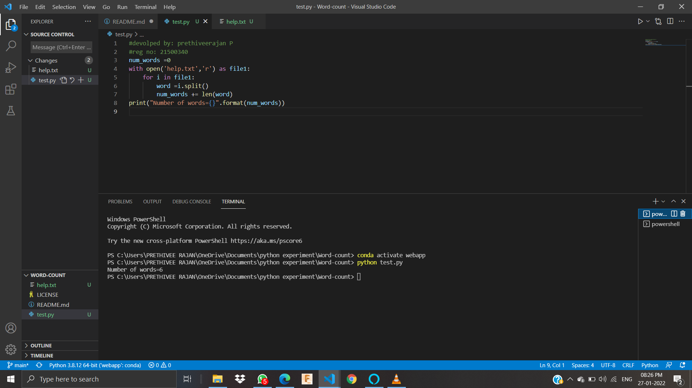
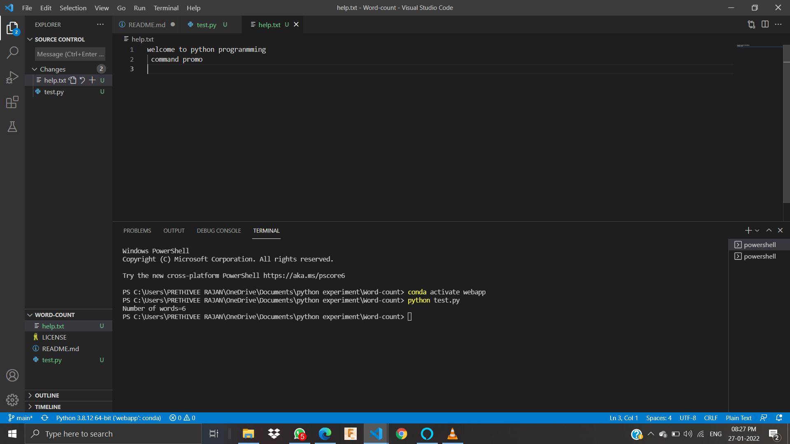

# Word-count
## AIM:
To write a python program for getting the word count from a text.
## EQUIPEMENT'S REQUIRED: 
PC
Anaconda - Python 3.7
## ALGORITHM: 

## Step 1: Open visual studio code.

## Step 2: Create file with .py extension.

## Step 3: Start the program.

## Step 4: Write the code.

## Step 5: Run terminal for output of the given program.

## Step 6: End the program.


### Programm:
```
#devolped by: prethiveerajan P
#reg no: 21500340
num_words =0
with open('help.txt','r') as file1:
    for i in file1:
        word =i.split()
        num_words += len(word)
print("Number of words={}".format(num_words))
```
### OUTPUT :


## file content:



## RESULT:
Thus the program is written to find the word count from a text.
